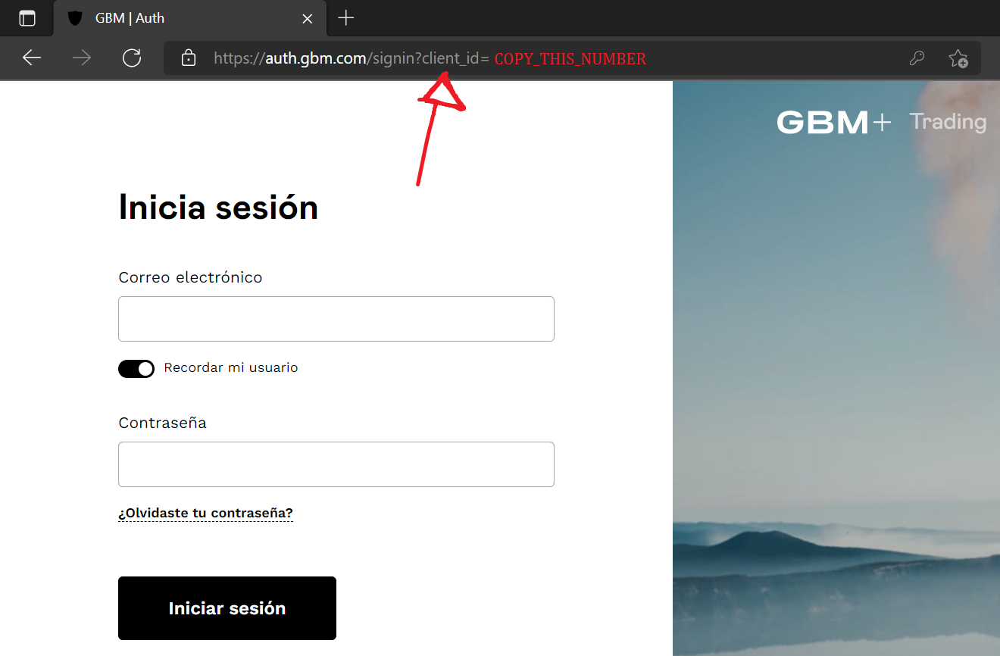

# GBM Plus API Python Library

The GBM Plus API Python library aims to provide all current API calls to interface with the GBM Plus/Homebroker platform.

## Setup

1. Get the CLINET_ID from the GBM Plus login dashboard


2. Keep your USER_EMAIL, PASSWORD and CLIENT_ID safe and secure. You can use environment variables for development.

3. Install the latest version of [Python 3](ttps://wiki.python.org/moin/BeginnersGuide/NonProgrammers)

4. Clone this repository

```shell
git clone https://github.com/markzuckerbergas/gbmplus-api-python
```

## Usage
1. Export your USER_EMAIL, USER_PASSWORD and CLIENT_ID as [environment variables](https://www.twilio.com/blog/2017/01/how-to-set-environment-variables.html), for example:

    Linux
    ```shell
    export USER_EMAIL=xxxxxx@xxxxx.com
    export USER_PASSWORD=shabadabadashabadabadaenelcentrodelplaneta
    export CLIENT_ID=xxxxxxxxxxxxxxxxxxx
    ```

    Windows Powershell
    ```powershell
    $env:USER_EMAIL="xxxxxx@xxxxx.com"
    $env:USER_PASSWORD="shabadabadashabadabadaolvidadoenlabanqueta"
    $env:CLIENT_ID="xxxxxxxxxxxxxxxxxxx"
    ```

2. Alternatively, define your USER_EMAIL, USER_PASSWORD and CLIENT_ID as variables in your source code; this method is not recommended due to its inherent insecurity.

3. Create a new Python file inside the cloned directory (for example, main.py). Single line of code to import and use the library goes at the top of your script:

    ```python
    import gbmplus
    ```

4. Instantiate the client (API consumer class), optionally specifying any of the parameters available to set:

    ```python
    trader_object = gbmplus.GBMPlusAPI(output_log=False)
    ```

5. Make API calls in your source code, using the format _client.scope.operation_, where _client_ is the name you defined in the previous step (**trader_object** above), _scope_ is the corresponding scope that represents a module, and _operation_ is the operation of the API endpoint. For example, to make a call to get the list of Accounts (or Strategies), use this function call:

    ```python
    accounts = trader_object.accounts.getAccounts()
    print(accounts)
    ```

### Examples
You can find working example scripts in the **examples** folder.
| Script                  | Purpose                                                                                                                                                                                                                                                                                                                                                                                                                                                                                                                                                                                                                                                                                                                                                                                                                                                                             |
|-------------------------|-------------------------------------------------------------------------------------------------------------------------------------------------------------------------------------------------------------------------------------------------------------------------------------------------------------------------------------------------------------------------------------------------------------------------------------------------------------------------------------------------------------------------------------------------------------------------------------------------------------------------------------------------------------------------------------------------------------------------------------------------------------------------------------------------------------------------------------------------------------------------------------|
| **transfer.py** | Transfer from the Smart Cash strategy to a target strategy                                                                                                                                                                                                                                                                                                                                                                                                                                                                                                                                                                                                                                |